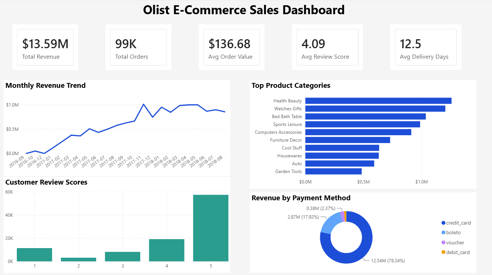
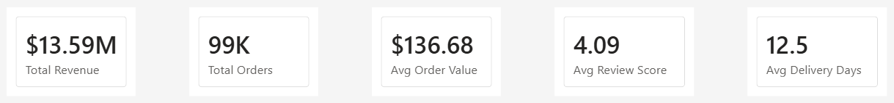
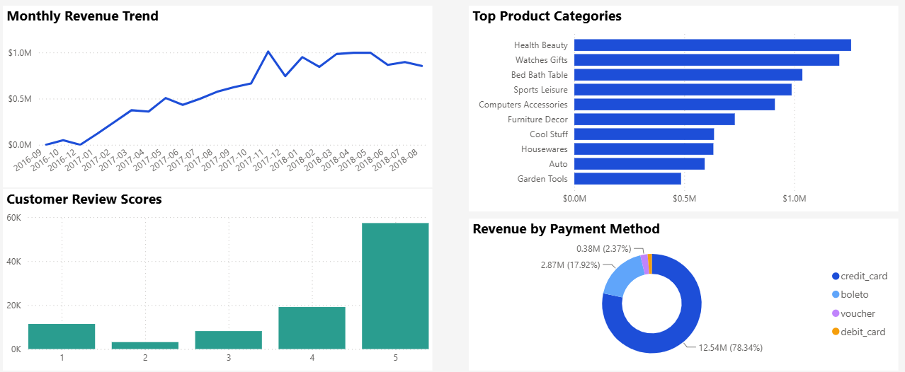

# Olist E-Commerce Sales Dashboard

Interactive Power BI dashboard built to analyze sales performance, customer reviews, product categories, and payment behavior using the Olist Brazilian E-Commerce dataset. This project demonstrates end-to-end business intelligence skills including data preparation, data modeling, DAX calculations, and dashboard design.



---

# Project Overview

This dashboard provides an executive overview of key e-commerce performance metrics using the Olist Brazilian E-Commerce dataset. It transforms multiple raw datasets into an interactive dashboard that enables users to monitor sales trends, evaluate customer satisfaction, identify top-performing product categories, and analyze payment method usage.

The project was built entirely in **Microsoft Power BI** using Power Query, a star schema data model, DAX measures, and interactive visualizations.

---

# Business Objectives

The dashboard was designed to answer questions such as:

- How has revenue changed over time?
- Which product categories generate the most revenue?
- How satisfied are customers based on review scores?
- Which payment methods are used most frequently?
- What are the key business performance indicators?

---

# Dashboard Features

## Executive KPI Cards

- Total Revenue
- Total Orders
- Average Order Value
- Average Review Score
- Average Delivery Days



---

## Interactive Visualizations

The dashboard includes:

- Monthly Revenue Trend
- Top Product Categories by Revenue
- Customer Review Score Distribution
- Revenue by Payment Type

These visualizations allow users to quickly identify business trends and performance metrics.



---

# Data Preparation

The data was cleaned and transformed using **Power Query** before building the dashboard.

Key preparation steps included:

- Imported multiple CSV datasets
- Removed unnecessary columns
- Replaced missing product categories with **"Unknown"**
- Merged product category translations
- Standardized category names
- Created a Calendar table for time-based analysis

---

# Data Model

The dashboard uses a **star schema** centered around the Orders and Order Items tables.

Related dimension tables include:

- Customers
- Products
- Sellers
- Payments
- Reviews
- Calendar

This structure improves model performance and follows common business intelligence best practices.

---

# DAX Measures

Custom DAX measures were created to calculate key business metrics, including:

- Total Revenue
- Total Orders
- Average Order Value
- Average Review Score
- Average Delivery Days

These measures power the KPI cards and visualizations throughout the dashboard.

---

# Key Business Insights

Some insights from the dashboard include:

- Revenue steadily increased throughout most of the available time period.
- Health Beauty and Watches Gifts were the highest revenue-generating product categories.
- Most customer reviews received the maximum rating of **5**, indicating generally positive customer satisfaction.
- Credit cards were by far the most frequently used payment method.

---

# Tools Used

- Microsoft Power BI
- Power Query
- DAX
- Data Modeling
- GitHub

---

# Dataset

This project uses the **Brazilian E-Commerce Public Dataset by Olist**, available on Kaggle.

**Dataset Source**

https://www.kaggle.com/datasets/olistbr/brazilian-ecommerce

The dataset contains information about:

- Customers
- Orders
- Order Items
- Products
- Sellers
- Payments
- Customer Reviews
- Product Category Translations

---

# Repository Structure

```text
olist-powerbi-sales-dashboard/
│
├── images/
│   ├── dashboard-overview.png
│   ├── dashboard-kpis.png
│   └── dashboard-charts.png
│
└── README.md
```

---

# Future Improvements

Potential future enhancements include:

- Interactive slicers for filtering dashboard results
- Additional customer segmentation analysis
- Geographic sales analysis
- Profit and profitability metrics
- Sales forecasting using time-series analysis

---

## Author

**Angelo Calingo**

Recent Computer Science graduate with an interest in Business Intelligence, Data Analytics, and Real Estate Analytics.
